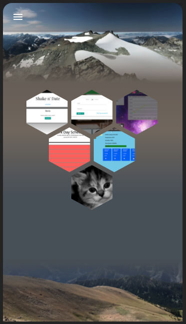
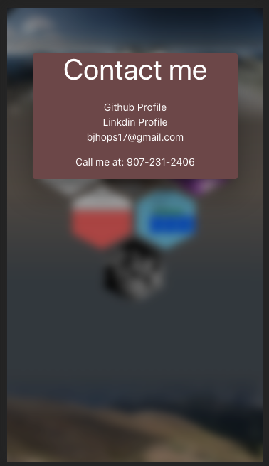

  # React Portfolio

  

  ## Description

  Its an updated portfolio using React as a framework.

  ## Images

<a href="https://bh-portfolio-react.herokuapp.com/">Deploy Link</a>
  
  ## Table of Content

  * [Installation](#installation)

  * [Usage](#usage)

  * [License](#license)

  * [Contributing](#contributors)

  * [Contact](#questions/contact)

  ## Installation

  To Install necessary dependencies, run the following command:
  
  N/A

  ## Usage

      Click things.
  
  ## Technologies

      React, JSON, CSS, Materialize.

  ## Contributors

  Ben Hopkins

  ## Questions/Contact

  <a href="https://github.com/bh007183">GitHub Profile</a>
  <a href="mailto:bjhops17@gmail.com"> Email Me</a>
  
  

  